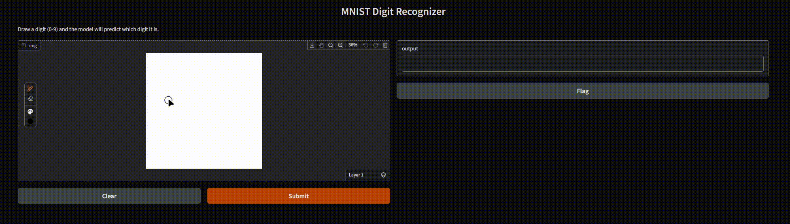
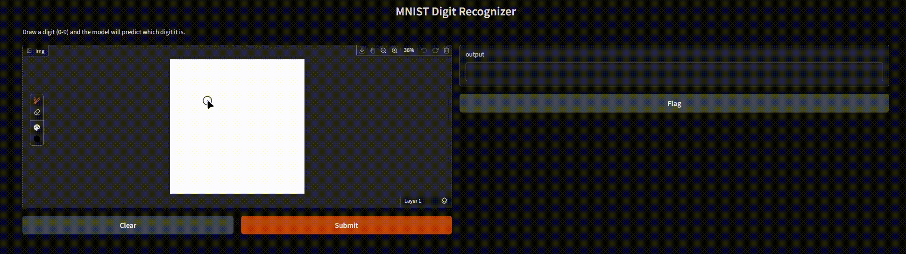

# 🧠 MNIST Digit Classifier with Neural Network

This project implements a simple fully-connected neural network trained on the MNIST dataset to recognize handwritten digits (0–9). A Gradio-powered front end allows users to draw digits and receive predictions in real time.

## 🎯 Features

- Dense neural network using Keras
- Trained on MNIST dataset
- Gradio web interface with drawing input
- Real-time digit prediction

## 🚀 Demo

### ✏️ Draw and Predict

  

### 🧾 Model Feedback

  

